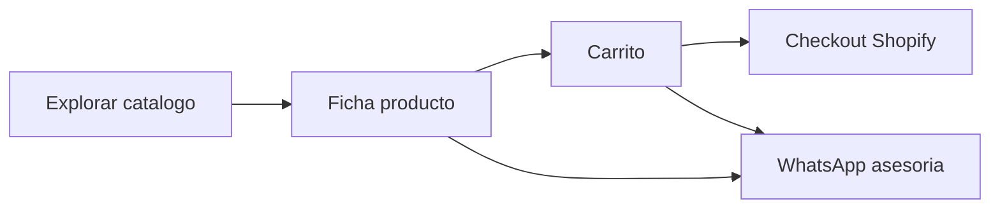

# 03 — Operación y experiencia NANOTRONICS

> **Estado:** Borrador v1 — políticas legales deben revisarse con contador/abogado.

## Resumen operativo

| Proceso | Política borrador | Estado |
|---------|-------------------|--------|
| Envío gratis | Compras desde **$200.000** COP | CONFIRMADO en theme |
| Despacho | Mismo día si compra antes de **3:00 pm** | VALIDAR |
| Medellín / área metro | 1–2 días hábiles | VALIDAR |
| Resto Colombia | 2–5 días hábiles | VALIDAR |
| Recoger en tienda | Gratis · aviso por WhatsApp | VALIDAR tiempo preparación |
| Cambios | **5 días** · producto sin usar | VALIDAR política Shopify |
| Garantía productos | Oficial fabricante + respaldo NANOTRONICS | VALIDAR texto legal |
| Garantía reparación | **30 días** mano de obra | VALIDAR |

## Envíos

**Transportadoras (VALIDAR):** Servientrega, Coordinadora, Interrapidísimo.

**Umbral envío gratis:** $200.000 COP → en theme: `20000000` centavos Shopify.

**Corte despacho mismo día:** 3:00 pm hora Colombia.

**Zonas sin cobertura:** _PENDIENTE_ — listar si aplica.

## Pagos

| Método | Activo | Notas |
|--------|--------|-------|
| Tarjeta Visa / Mastercard | VALIDAR | Cuotas según pasarela |
| PSE | VALIDAR | |
| Nequi | VALIDAR | |
| Daviplata | VALIDAR | |
| Addi (sin tarjeta) | VALIDAR | |
| Efectivo en tienda | VALIDAR | |
| Transferencia | VALIDAR | |

**Cuotas en web:** "Hasta 36 cuotas" — `VALIDAR` máximo real con Addi/pasarela.

## Horarios y contacto

| Canal | Horario / SLA |
|-------|----------------|
| Tienda física | Lun a Sáb · 9 am - 7 pm |
| WhatsApp | Respuesta < 15 min en horario `VALIDAR` |
| Email | < 24 h hábiles |

## WhatsApp — mensajes por contexto

| Contexto | Setting theme | Mensaje borrador |
|----------|---------------|------------------|
| General (FAB) | `whatsapp_message` | Hola NANOTRONICS, me gustaría una asesoría 👋 |
| Producto (PDP) | `whatsapp_message_product` | Hola, me interesa este producto: |
| Servicio técnico | `whatsapp_message_service` | Hola, quiero solicitar servicio técnico para mi equipo |
| Carrito (futuro) | `whatsapp_message_cart` | Hola, tengo dudas sobre mi pedido en el carrito |

## Flujo de compra online

## Flujo servicio técnico

## SEO local (keywords borrador)

1. computadores El Carmen de Viboral
2. PC gamer Antioquia
3. reparar portátil Carmen de Viboral
4. portátiles Medellín envío
5. servicio técnico computadores oriente antioqueño

**Schema:** `LocalBusiness` en `snippets/meta-tags.liquid` — coordenadas `VALIDAR` en Theme Editor.

## Checklist legal / Shopify

- [ ] Política de envíos publicada en Shopify Admin
- [ ] Política de devoluciones alineada con `returns_days`
- [ ] NIT y razón social correctos en footer
- [ ] Facturación electrónica mencionada si aplica
